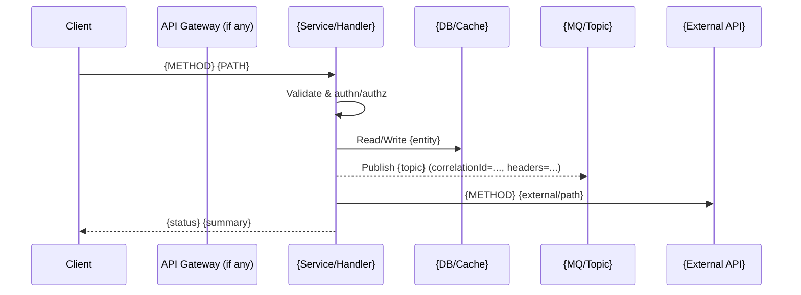

I want to understand all the places in this repository where we are writing to or updating messages in MQ (e.g., producing/publishing/sending messages).  
- Search for code that interacts with MQ clients, producers, or publish/send APIs.  
- Identify the functions, classes, or modules where MQ messages are sent.  
- For each location, summarize: 
  1. The queue/topic name being used (if available).  
  2. The structure or fields of the message being passed.  
  3. Any metadata, headers, or correlation IDs being set.  
  4. Which part of the application triggers this message.  
Return a consolidated report so I can see what information we’re passing into MQ across the repo.


Here’s a ready‑to‑paste Copilot Chat prompt that will:

1. enumerate all endpoints in the repo, 2) trace each endpoint’s full execution flow (DB, MQ, external calls, etc.), and 3) create/update a Markdown report file.


---

Prompt for GitHub Copilot Chat

You are analyzing this repository to produce a complete catalog of HTTP endpoints and their execution flows.

GOAL
==== 
1) Discover ALL HTTP endpoints configured in the codebase.
2) For EACH endpoint, generate a detailed flow of operations the request triggers.
3) Write everything into a single Markdown file at docs/endpoints-flow.md (create the folder/file if they don’t exist), replacing the file content entirely.

SCOPE HINTS
=========== 
Detect endpoints across common frameworks/languages:
- Java/Spring (annotations like @RestController, @Controller, @RequestMapping, @GetMapping, @PostMapping, @PutMapping, @DeleteMapping)
- Node/Express (app.get/post/put/delete, router.METHOD, express.Router())
- Python/FastAPI/Flask (FastAPI .get/.post decorators, Flask @app.route)
- Go (gorilla/mux, chi, net/http handlers)
- Ruby on Rails (routes.rb, controller actions)
- .NET (MapGet/MapPost, ControllerBase with [HttpGet]/[HttpPost] etc.)
Also check OpenAPI/Swagger files, route registries, middleware/filters, API gateway config (if present).

FOR EACH ENDPOINT, CAPTURE
========================== 
- Endpoint signature: HTTP method, path, controller/handler function name, file path, line link (file:line).
- Request contract: path/query/body params, content-type, auth requirements (e.g., JWT, API key, OAuth scopes), rate-limits/feature flags/AB toggles.
- Response contract: status codes, response schema/model, error shapes.
- Middlewares/filters/interceptors: authn/authz, validation, rate limiting, tracing, logging, request shaping.
- Execution FLOW (step-by-step):
  1) Input validation and transformations
  2) Calls to internal services/modules
  3) Database operations (ORM calls, SQL queries) – include table/collection names and key fields if visible
  4) Cache usage (get/set/delete; keys/prefixes)
  5) MQ/stream publishes (topic/queue, headers/correlationId, payload structure)
  6) External API calls (host/path, method, headers set, request/response fields)
  7) Background jobs / async tasks / schedulers triggered
  8) Telemetry: metrics/logs/traces emitted (metric names, labels/tags, log events), and any SLO/SLA implications
  9) Error handling/retries/circuit breakers/idempotency tokens and compensating actions

- Security/Resilience notes: input sanitization, PII handling, secrets usage, timeouts, retry/backoff, circuit breaker, bulkheads, fallbacks.
- Performance notes: obvious N+1s, heavy serialization, large payloads, blocking IO on hot paths.

OUTPUT FORMAT (Markdown)
========================
Rewrite docs/endpoints-flow.md with:
1) Title and generated timestamp.
2) Repo-wide TOC of endpoints in a table:

| Method | Path | Handler | File:Line | Auth | Notes |
|-------:|------|---------|-----------|------|-------|

3) Per-endpoint section with the following structure:

#### {METHOD} {PATH}
**Handler**: `{package.module.Class#method}`  
**File**: `relative/path/to/file.ext:LINE`  
**Auth**: `{none | JWT | OAuth2(scopeA, scopeB) | API key | …}`  
**Request**  
- Path params: `{...}`  
- Query params: `{...}`  
- Body schema: `{...}`  

**Response**  
- Status codes: `200, 400, 401, 404, 500`  
- Body schema: `{...}`  

**Middlewares / Filters**  
- `{name -> purpose}`

**Execution Flow (step-by-step)**  
1. …  
2. …  
3. …

**Data Access**  
- DB reads/writes: `{table/collection, operation, key fields}`  
- Cache ops: `{get/set/del, key patterns}`  

**Messaging / MQ**  
- Publish to: `{queue/topic}`  
- Headers/metadata: `{correlationId, messageId, contentType, custom headers}`  
- Payload fields: `{...}`  

**External Calls**  
- `{METHOD host/path} – headers set: {...}; request fields: {...}; response fields: {...}`  

**Telemetry & SLO Signals**  
- Metrics: `{name(labels)}`  
- Logs: `{event names/levels}`  
- Traces: `{span names, attributes}`  

**Errors & Resilience**  
- Exceptions handled, retry/backoff, timeouts, circuit breakers, idempotency keys, compensations.

**Mermaid Sequence (if enough detail is available)**  


DISCOVERY STEPS (what I want you to do)

1. Repo-wide search for routing/endpoint declarations and OpenAPI specs.


2. For each endpoint, jump to its handler and recursively trace calls across files/modules to find DB/MQ/Cache/External interactions and middleware.


3. Extract concrete details from code (variables/constants) whenever possible. If dynamic, state “dynamic (computed from …)”.


4. Include code references as relative/path:line for each significant step.


5. If the repo is large, process in batches and keep appending to the same Markdown (but the final message should present the complete updated file content).


FILE WRITE

Create or update docs/endpoints-flow.md with the generated content. If the editor supports it, insert/update the file directly. If not, print the entire Markdown so I can copy-paste.

IMPORTANT

Be precise; prefer reading constants and config files (YAML/TOML/ENV) to resolve dynamic values (e.g., base URLs, queue names, feature flags).

Note framework-specific features (e.g., Spring AOP interceptors, Express middlewares, FastAPI dependencies) that alter the flow.

Prefer exact names and code-linked evidence over guesses. When uncertain, explicitly mark as “unknown” and show the reference.


---

#### Optional framework-specific booster lines (append as needed)

- **Spring Boot (Java/Kotlin):**  
  “Also scan for: `@RestController`, `@Controller`, `@RequestMapping`, `@GetMapping`, `@PostMapping`, `HandlerMethodArgumentResolver`, `OncePerRequestFilter`, `HandlerInterceptor`, `WebMvcConfigurer`, `RestTemplate/WebClient/FeignClient` usage, `@Transactional`, `JdbcTemplate`, JPA repositories, Resilience4j annotations, and `OpenAPI` docs.”

- **Node/Express/NestJS:**  
  “Also scan for: `express.Router()`, `router.METHOD`, global/route middlewares, `axios/fetch/got` calls, TypeORM/Prisma/Mongoose ops, NestJS `@Controller` & `@Get/@Post` plus `Interceptors/Guards/Pipes`.”

- **Python FastAPI/Flask/Django:**  
  “Also scan for: FastAPI `APIRouter`, dependencies, Pydantic models, Flask blueprints, Django `urls.py` and `views`, `requests/httpx`, ORM calls.”

---


Here’s a drop‑in Copilot Chat prompt that (a) finds each endpoint, (b) traces every call (controllers → services → repos → external/MQ), (c) summarizes each method’s requirements (inputs, preconditions, contracts), and (d) writes a highly user‑intuitive Markdown doc using collapsible sections, tables, and Mermaid diagrams.


---

Copilot Prompt — Spring Boot Endpoint Call Map (per‑endpoint)

ROLE
You are a senior Spring Boot code-analysis assistant. Produce deterministic, evidence-linked results with file:line citations.

OBJECTIVE
For every HTTP endpoint, generate a detailed “Call Map” that enumerates ALL method calls (direct + transitive), with a short, practical description of what each method does and what it requires. Output one Markdown file per endpoint under docs/endpoints-calls/ and an index README.

WHY / FORMAT CHOICES (for usability)
- Use GitHub-flavored Markdown with <details> blocks for collapsible deep sections.
- Provide two complementary visuals:
  1) A Mermaid "flowchart" to show the high-level call graph (fan-out).
  2) A Mermaid "sequence" diagram to show actual execution order for the happy path.
- Add a "Methods Catalog" table listing each method once with signature, purpose, inputs, preconditions, side effects, errors, and citations.
- Make all method entries include source evidence: relative file path + line number.

SCOPE (SPRING TARGETS)
- Endpoints: @RestController/@Controller with @RequestMapping/@GetMapping/@PostMapping/@PutMapping/@PatchMapping/@DeleteMapping (class + method).
- Trace calls across:
  - Services/Components; @Transactional boundaries and AOP (@Aspect advice).
  - DB: Spring Data repositories, @Query (JPQL/SQL), JdbcTemplate/R2DBC/MyBatis.
  - Cache: @Cacheable/@CachePut/@CacheEvict.
  - Messaging: KafkaTemplate, RabbitTemplate, JmsTemplate (IBM MQ), Spring Cloud Stream.
  - External HTTP: RestTemplate/WebClient/FeignClient (collect base URLs from @Value/@ConfigurationProperties/application.yml).
  - Resilience4j: @Retry/@CircuitBreaker/@RateLimiter/@Bulkhead/@TimeLimiter.
  - Validation: Bean Validation (JSR-380) and custom validators.
  - Security: @PreAuthorize/@PostAuthorize and SecurityFilterChain rules that affect the endpoint.

DISCOVERY STEPS (DO IN ORDER)
1) Find endpoints and resolve full path + method + produces/consumes (class-level + method-level mapping).
2) For each endpoint handler, trace the call tree depth-first (limit to business-relevant paths; ignore trivial getters).
3) At each method, capture:
   - Signature: FQN#method(params) with param types.
   - Purpose: one-sentence plain-English summary from code/comments/names.
   - Requires (inputs & preconditions): non-null params, auth/roles, feature flags, DTO field expectations, validation annotations.
   - Side effects: DB writes, cache mutations, MQ publishes, external HTTP calls.
   - Throws/Errors: exceptions, error responses, retry/backoff, circuit breakers.
   - Transactional context: @Transactional or programmatic tx.
   - Evidence: file:line.
4) Extract config constants from application*.yml/properties and @ConfigurationProperties; if unresolved, show property key and where it’s defined.
5) Build diagrams from the traced graph (flowchart for structure; sequence for typical order).

OUTPUT RULES
Create or overwrite:
- docs/endpoints-calls/README.md   (index)
- docs/endpoints-calls/{slug}.md   (one per endpoint)

Slug rule: "{method_lower}_{path}" with "/" -> "_", ":" removed, "*" -> "star", path params kept as "{id}" (or "_param_" if needed).

PER-ENDPOINT FILE TEMPLATE (use exactly this structure)

# {METHOD} {PATH}
**Handler**: `{package.Class#method}`  
**File**: `relative/path/File.java:LINE`  
**Produces/Consumes**: `...`  
**Auth**: `{none | permitAll | JWT | OAuth2(scopes) | hasRole(...) | @PreAuthorize(...)}`

<details>
<summary><strong>High-Level Call Graph (Mermaid flowchart)</strong></summary>

```mermaid
flowchart TD
  C[Controller {Class#method}] --> S1[{ServiceA#op}]
  S1 -->|DB| R1[(RepositoryX#find...)]
  S1 -->|MQ| MQ1>JmsTemplate/KafkaTemplate: send ...]
  S1 -->|HTTP| X1[ExternalClient#call...]
  C --> S2[{ServiceB#op}]:::optional
  classDef optional stroke-dasharray: 3 3

</details><details>
<summary><strong>Happy-Path Sequence</strong></summary>sequenceDiagram
  participant Client
  participant C as Controller
  participant S as Service(s)
  participant DB as DB/Cache
  participant MQ as MQ
  participant EXT as External API

  Client->>C: {METHOD} {PATH}
  C->>S: {ServiceA#op}(key params)
  S->>DB: read/write {Entity/Table}
  S-->>MQ: publish {dest} (correlationId=...)
  S->>EXT: {METHOD} {external/path}
  C-->>Client: {status} {summary}

</details>Methods Catalog

#	Location (file:line)	Method	Purpose (1‑liner)	Requires (inputs & preconditions)	Side Effects	Throws/Errors	Txn

1	src/.../OrderController.java:123	OrderController#getById(String id)	Load order and enrich	id != null, auth hasRole('USER')	none	NotFoundException	none
2	src/.../OrderService.java:88	OrderService#load(String id)	Fetch order & status	id, feature orders.enabled=true	DB read	OrderMissingException	@Transactional(readOnly=true)
3	src/.../OrderRepo.java:45	OrderRepo#findById(UUID)	JPA fetch	valid UUID	DB read	-	inherited
4	src/.../MqPublisher.java:60	publish(OrderEvent)	Emit order event	non-null event; correlationId set	MQ publish to ${mq.orders-topic}	retries via @Retry	none
5	src/.../BillingClient.java:72	charge(...)	Call billing API	token present; amount>0	HTTP POST to ${billing.base-url}/charge	HttpStatusCodeException	timeout=2s


> Include every unique method in the path exactly once in this table. Add rows for caches, validators, AOP advice, and exception handlers if relevant.


Endpoint Notes

Validation & Security: {@Valid DTO constraints, @PreAuthorize rules, CORS, rate limits}

Config Used: {property keys -> resolved values if safe} (redact secrets)

Idempotency: {keys/headers used, dedupe strategies}

Observability: {Micrometer metrics, span names/attributes, log events}

Error Mapping: {@ExceptionHandler mappings to HTTP codes}


Evidence

Primary handler: relative/path/File.java:LINE

Service chain: list all file:line

Repositories/Queries: file:line (include @Query bodies)

MQ/External: file:line + property keys


INDEX FILE (docs/endpoints-calls/README.md)

Title and generated timestamp (UTC).

Table of all endpoints with links to per-endpoint pages:


Method	Path	Handler	File:Line	Auth	Calls Doc


QUALITY GATES

Every fact has at least one file:line citation.

Summaries are specific and action-oriented (avoid vague “handles logic”).

Sort methods in catalog by call order; sort endpoints by path then method.

Mark uncertainty as unknown or dynamic(...) with cited symbol.

Resolve config values from application*.yml or @ConfigurationProperties; if unresolved, show the key and where defined.

Redact secrets.


WRITE FILES

Create/overwrite Markdown files. If file writes are not supported, print the full content with filenames for manual save.


---

## Why this output is the most intuitive
- **Collapsible sections** (`<details>`): skim at a glance, expand for depth.
- **Two diagrams, two views**: *flowchart* for structure (what calls what), *sequence* for order (how a request actually runs).
- **Methods Catalog table**: one‑row‑per‑method checklist of “what it needs” and “what it does”—perfect for reviews and audits.
- **Evidence‑first**: every row has `file:line`, keeping it trustworthy and easy to navigate in code.
- **SRE‑friendly extras**: highlights idempotency, resilience, telemetry, and config—all critical for operability.
 


---

Master Prompt (curious/exhaustive dependency discovery)

You are running locally inside VS Code with access to the full workspace.

Goal (POC): For the Java Spring Boot upload flow, generate:

1. docs/upload-flow.md – full narrative with code pointers and all external dependencies


2. diagrams/upload-sequence.mmd – Mermaid sequence diagram


3. diagrams/upload-graph.mmd – Mermaid dependency graph


Scope & Safety

Local workspace only. No network calls.

Idempotent: if files exist, overwrite them.

Prefer facts from code; when uncertain, add to “Gaps & Questions” with evidence.


---

What to Detect (be curious; go beyond MQ & CM)

A. Ingress & Core path (upload)

Spring MVC/WebFlux controller for upload (e.g., @PostMapping("/v1/upload"), @RequestMapping(method=POST, path="/v1/upload")).


B. Messaging

IBM MQ/JMS producers: JmsTemplate.convertAndSend(...), wrappers, MessageProducer.

IBM MQ/JMS consumers: @JmsListener(destination="..."), MessageListener.

Also scan for other brokers (even if unlikely): Kafka (KafkaTemplate, @KafkaListener), RabbitMQ (RabbitTemplate, @RabbitListener). If found, include.


C. HTTP/gRPC/SOAP externals

REST clients: RestTemplate, WebClient, @FeignClient, OkHttpClient, Apache HttpClient.

gRPC: ManagedChannelBuilder, generated stubs.

SOAP: JaxWsPortProxyFactoryBean, WebServiceTemplate.

Identify service name/host/base path, operation (guess from method/URI), and client class/method.


D. Data stores & caches

Relational DB: DataSource, JdbcTemplate, JPA (EntityManager, CrudRepository/JpaRepository).

NoSQL: Mongo (MongoTemplate, repositories), Cassandra, DynamoDB.

Search: Elasticsearch/Solr clients.

Caches: Redis (Lettuce/Jedis, RedisTemplate), Hazelcast, Ehcache, Caffeine.


E. Object/file storage & filesystems

S3/MinIO SDK, GCS, Azure Blob, NFS/Samba paths, local FS writes for payloads/temp files.

FTP/SFTP libraries.


F. Security, identity, feature/config

OAuth/OpenID (Spring Security, OAuth2AuthorizedClientManager), LDAP.

Feature flags: Unleash, FF4J, LaunchDarkly.

Config servers/secrets: Spring Cloud Config, Vault, KMS usage.


G. Infra & utilities that cross boundaries

Email/SMS/Push: JavaMail/SMTP, SNS/SQS, Twilio, FCM.

PDF/AV/DLP/ICAP: antivirus (ClamAV/ICAP), DLP scanners, PDF services.

Shell/system calls: ProcessBuilder, Runtime.exec.

Schedulers: @Scheduled, Quartz (if they trigger upload steps).


> For everything discovered, capture type, library used, identifier (queue, topic, URL, table, bucket), file:line, and evidence snippet (one line is enough).


---

Required Outputs (overwrite if exist)

1) docs/upload-flow.md

Structure:

# Upload Flow (POC)

## TL;DR
One-paragraph summary of POST /v1/upload end-to-end, including key external dependencies found.

## Code Entry Point (Ingress)
- Route & method (e.g., `POST /v1/upload`)
- Controller class & method with **file:line** reference(s)

## Sequence of Events (Step-by-step)
1) Client → Gateway (controller): validations/transforms.
2) Gateway → MQ (producer): destination, message shape (if visible).
3) Worker (consumer): class & method, main logic.
4) Worker → IBM Content Manager (CM): operation & path.
5) **Other externals discovered** (DB/cache/object storage/HTTP calls/etc.): describe where they fit in the upload path.
- Provide **file:line** for each step; include a one-line **evidence snippet** where helpful.

## External Dependencies (Comprehensive)
| Category     | Tech/Lib             | Identifier (queue/url/table/…) | Where Found (file:line) | Role in Upload | Notes |
|--------------|----------------------|---------------------------------|-------------------------|----------------|-------|
| Messaging    | IBM MQ (JMS)         | …                               | …                       | produce/consume| …     |
| External API | IBM CM (REST/SOAP)   | …                               | …                       | createDocument | …     |
| REST Client  | (others, if any)     | …                               | …                       | …              | …     |
| DB           | (JPA/JdbcTemplate)   | …                               | …                       | meta writes?   | …     |
| Cache        | (Redis/Ehcache/…)    | …                               | …                       | …              | …     |
| ObjectStore  | (S3/MinIO/GCS/NFS)   | …                               | …                       | …              | …     |
| Auth/Config  | (OAuth/Vault/Config) | …                               | …                       | …              | …     |
| Scheduler    | (Quartz/@Scheduled)  | …                               | …                       | …              | …     |
| Other        | (Email/ICAP/…)       | …                               | …                       | …              | …     |

## Config Keys
List all relevant properties (routes, MQ destinations, hosts, credentials refs, timeouts, retries), with **file:line**.

## Data Contracts (as known)
- HTTP request: headers/body essentials.
- MQ message: headers (trace/context) & payload outline.
- CM request/response: fields used downstream.

## Resilience & Policies (if present)
- Timeouts, retries, circuit breakers (Resilience4j annotations/config), bulkheads, fallbacks (with **file:line**).

## Gaps & Questions
- Ambiguities or multiple possible paths; what to confirm with devs.

## Next Steps
- What to automate next for the flow spec and diagrams.

2) diagrams/upload-sequence.mmd

Create a valid Mermaid sequence diagram that reflects everything found. Include “other externals” as separate participants if they participate in the request path.

Skeleton to fill with real names:

sequenceDiagram
  autonumber
  participant C as Client
  participant GW as Gateway (POST /v1/upload)
  participant MQ as IBM MQ (QUEUE: <name>)
  participant WK as Worker
  participant CM as IBM Content Manager
  %% Optional discovered participants
  participant DB as Database
  participant OS as Object Store
  participant EXT as External API (Other)

  C->>GW: POST /v1/upload
  GW->>GW: Validate/Transform (mention AV/DLP if any)
  GW->>MQ: Publish (destination, headers)
  WK-->>MQ: Consume
  WK->>CM: createDocument(...)
  CM-->>WK: Response (docId/…)
  WK->>DB: Persist metadata (if any)
  WK->>OS: Store content (if any)
  WK-->>GW: Ack/Update
  GW-->>C: 202 Accepted / 200 OK

3) diagrams/upload-graph.mmd

Create a valid Mermaid LR flowchart of nodes/edges using stable IDs (UPPER_SNAKE with dots allowed). Include newly discovered externals as nodes.

flowchart LR
  A[UPLOAD.API.INGRESS<br/>POST /v1/upload] --> B[UPLOAD.VALIDATE]
  B --> C((MQ: <QUEUE>))
  C --> D[UPLOAD.WORKER.CONSUME]
  D --> E[UPLOAD.CM.API<br/>createDocument]
  D --> F[(DB: <table>)]
  D --> G[(ObjectStore: <bucket/path>)]
  %% Add other external edges if they exist

Only include nodes/edges that actually exist; no placeholders.


---

How to Gather Evidence (search heuristics)

Search code & configs (Java/Kotlin/YAML/properties/XML):

Spring MVC/WebFlux: @PostMapping, @RequestMapping, RouterFunction, HandlerFunction.

JMS (IBM MQ): JmsTemplate.convertAndSend, @JmsListener, DefaultJmsListenerContainerFactory, MQQueue, MQQueueManager, com.ibm.mq.

Kafka/Rabbit (just in case): KafkaTemplate, @KafkaListener, RabbitTemplate, @RabbitListener.

HTTP clients: RestTemplate, WebClient, @FeignClient, OkHttpClient, Apache HttpClients, HttpUrlConnection.

gRPC/SOAP: ManagedChannelBuilder, generated stubs, WebServiceTemplate, JAX-WS proxies.

DB: DataSource, JdbcTemplate, EntityManager, Repository interfaces, @Table, SQL files.

Cache: RedisTemplate, Lettuce, Jedis, Hazelcast, Ehcache, Caffeine.

Object storage: AmazonS3, MinioClient, BlobServiceClient, Files.copy to network paths.

Security/Config: Spring Security OAuth2 classes, VaultTemplate, ConfigServicePropertySourceLocator.

Resilience: @Retry, @CircuitBreaker, @TimeLimiter, config keys resilience4j.*.

Schedulers: @Scheduled, Quartz Scheduler.

Misc. externals: JavaMail Transport.send, ProcessBuilder, Runtime.exec, FTP/SFTP libs.


When you find a candidate:

Record category, library, identifier (queue/url/table/bucket), file:line, and a 1-line snippet (e.g., the call or annotation).

If multiple candidates exist, prefer the ones directly in the upload path; list alternates under Gaps & Questions.


---

Acceptance Criteria

All three files are created and render correctly (Mermaid has no syntax errors).

docs/upload-flow.md includes at least:

One http_server (upload route) with file:line,

One mq_produce and one mq_consume with destinations and file:line,

One external_api call to CM with file:line,

Any other external dependency found (DB/cache/object store/other REST/etc.) with file:line, or an explicit “None found” statement.


Doc includes Config Keys and Resilience (if present).

Ambiguities are captured in Gaps & Questions with evidence.


Now execute the above using the workspace code to drive specifics. If something is unclear, include it in Gaps & Questions with the best hypotheses and evidence.

 
